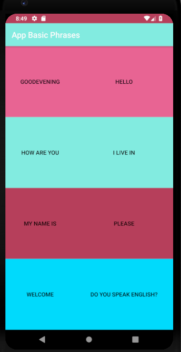

# Language-Translator
## **An android application that translates some basic phrases from English to French**

#### This is one of the projects that I worked on while learing Android development, it is written in Java. This app helps the user to learn pronuncation of different phrases in French by playing an audio track of it when the user clicks on the respective English phrase. 

                 

Hope you enjoy :)
